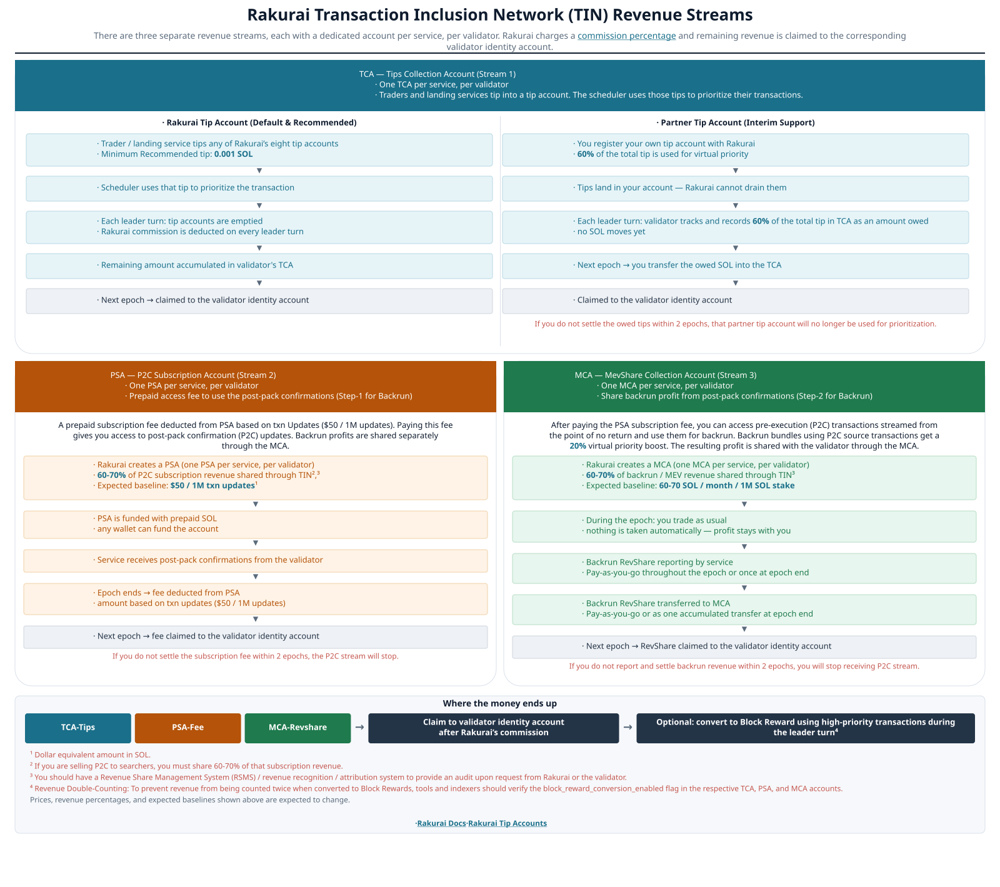

# TIN - MEV Services

**The Rakurai Transaction Inclusion Network (TIN) is a decentralized aggregator that brings lightning-fast inclusion and MEV sharing to Rakurai validators.** It allows multiple transaction-landing services to access Rakurai validators, allowing them to access Rakurai stake and provide transaction and bundle order flow for inclusion.

For a validator, that is an additional source of rewards on top of block rewards & jito tips. For a searcher or landing service, it is a way to reach Rakurai stake through your own block engine and to use Pre-confirmation (Post-Pack Confirmation) from point of no return.

**Why it exists.** Instead of relying on a single revenue stream, a Rakurai validator receives high-quality orderflow from **multiple transaction landing services for inclusion** in the block. That is what lets the validator consistently capture higher rewards per block, and it needs no extra components.

**Audience:** TIN partners, block engines, MEV searchers, and traders sending bundles or consuming post-pack confirmations.

**Related:** [Setup guide](./setup_guide.md) · [Revenue settlement](./revenue_settlement.md) · [Tips](./tips.md) · [Post-pack confirmations](./post_pack/README.md)

---

## 1. TIN building blocks

TIN is three integration surfaces. Accounting for money moved through them is in [Revenue streams](#2-revenue-streams).

| # | Building block | What it does | Who uses it | Guide |
|---|----------------|--------------|-------------|-------|
| 1 | **Multi-block-engine orderflow** | Validators connect to every registered landing service and select the lowest-latency endpoint | Block engines, landing services | [Setup guide](./setup_guide.md) |
| 2 | **Virtual priority boost** | A SOL tip raises scheduling priority for your transaction/bundle, without cannibalizing priority fees | Searchers, traders, landing services | [Tips](./tips.md) |
| 3 | **Post-pack confirmations (P2C)** | The scheduler streams transactions from the point of no return, so you get a front-run-proof signal and can reply with a backrun bundle | Searchers, TIN partners | [Post-pack confirmations](./post_pack/README.md) |

### 1.1. Multi-block-engine orderflow

Register a **discovery** endpoint once with Rakurai. That host’s `GetBlockEngineEndpoints` returns your `global_endpoint` and any `regioned_endpoints`; validators probe RTT and connect to the lowest-latency URL. Regional URLs live in **your** RPC response — not as separate on-chain entries. The same discovery RPC is used for **P2C** Relayer hosts. See [Setup guide — discovery](./setup_guide.md#5-discovery--global-url-for-bundles-and-p2c). Reference sample: [tin_sample_servers](https://github.com/rakurai-io/tin_sample_servers).

### 1.2. Virtual priority boost

A tip is a plain `SystemProgram.transfer` into one of the eight Rakurai tip accounts, included in your transaction or bundle. The scheduler reads that transfer as a priority signal. The boost is **additive**: a transaction with a large tip but almost no priority fee gains little, which prevents tips from cannibalizing the priority-fee market. See [Tips](./tips.md).

### 1.3. Post-pack confirmations (P2C)

P2C emits an update at the point of no return rather than on ledger confirmation: early enough to act on, late enough that nobody — including you — can front-run the original sender with it. Duplicate transactions are suppressed (one packet per transaction). Validators open a required **leader-time** Relayer stream — `StartExpiringPacketStream` for **ReSell** / PSA, or `StartExpiringMevPacketStream` for **Mev** / MCA — and may also open optional **TPU** (`StartExpiringTpuPacketStream`, Mev flag) and **per-slot count** streams. All carry the same packet type — distinguish them by which gRPC method delivered the message. Reply with a bundle that contains the original packet unchanged plus your own transactions. See [Post-pack confirmations](./post_pack/README.md) and [Using P2C](./post_pack/using_p2c.md).

---

## 2. Revenue streams

TIN revenue uses three on-chain account types. Click the diagram for a larger view.

**PSA or MCA for post-pack access** — resellers prepay a [PSA](./post_pack/psa.md); backrun partners share profit through an [MCA](./post_pack/mca.md) and do **not** PSA. Rakurai Tips (TCA) are independent of both.

Settlement checklist and CLI commands: [Revenue settlement](./revenue_settlement.md). Download CLIs from the [`rakurai_programs` releases](https://github.com/rakurai-io/rakurai_programs/releases/latest).

| Stream | Account | What it is | When you pay | Docs |
|--------|---------|------------|--------------|------|
| Tips / virtual priority | **TCA** | Tip into a tip account; the scheduler uses it to prioritize | At send time, per transaction or bundle | [Tip accounts](./tips.md#appendix-program-and-tip-account-addresses) · [Tips](./tips.md) · [TCA](../rakurai_programs/programs/reward_distribution/README.md#4-tca--tips-for-landing-transactions) |
| Post-pack / pre-conf | **PSA** | Prepaid fee for reselling access (leader-time stream) | In advance; deducted each epoch | [Rakurai-P2C CLI](../rakurai_programs/cli/p2c_subscription.md) · [PSA](./post_pack/psa.md) |
| Backrun / MevShare | **MCA** | Share of backrun profit — **replaces PSA** for this path; includes TPU stream | After each epoch: record, then transfer | [Rakurai-RevShare CLI](../rakurai_programs/cli/partner_reward_settlement.md) · [MCA](./post_pack/mca.md) |

Full program overview: [Reward Distribution](../rakurai_programs/programs/reward_distribution/README.md).

---

## 3. What TIN means for you

### 3.1. If you run a Rakurai validator

- **More blockspace monetization** — block rewards, tips, post-pack subscriptions, and backrun share, each accounted separately.
- **Higher-quality orderflow** — multiple services bid for the same blockspace.
- **No extra daemons** — TIN lives in the Rakurai client and on-chain programs.
- **Operator control** — Admin RPC lists and blocklists connected block engines and post-pack endpoints.

Start at [Validators](../validators/README.md).

### 3.2. If you are a landing service, searcher, or trader

- **Reach Rakurai stake through your own block engine.**
- **Pay for priority you need** — tips move scheduling order; the effect is bounded so a zero-fee transaction cannot game the market.
- **Buy a front-run-proof execution signal** — post-pack PSA is priced by Updates/txn (**$50 / 1M**), prepaid, and closable when you stop.
- **Settle on-chain** — amounts owed are recorded on-chain and checkable with the CLIs.

Start at [Setup guide](./setup_guide.md), then [Quick start](#4-quick-start).

---

## 4. Quick start

| Step | Action | Where |
|------|--------|-------|
| 1 | Understand what you will owe — TCA, PSA, MCA | [Revenue settlement](./revenue_settlement.md) |
| 2 | Onboard — share your discovery endpoint and a wallet pubkey you control with the Rakurai team | [Setup guide](./setup_guide.md) |
| 3 | Tip — **0.001 SOL** recommended per tipped transaction or bundle, on top of priority fees | [Tip accounts](./tips.md#appendix-program-and-tip-account-addresses) |
| 4 | Send traffic — bundles through your block engine | [Setup guide](./setup_guide.md) |
| 5 | Add post-pack (optional) — PSA for reselling **or** MCA for backrun; consume stream; tip reply bundles | [Post-pack](./post_pack/README.md) |
| 6 | Settle each epoch — MCA, and custom-tip TCA if you use one; download CLIs from the [latest release](https://github.com/rakurai-io/rakurai_programs/releases/latest) | [Revenue settlement](./revenue_settlement.md) |

---

## 5. Guides

| Guide | Description |
|-------|-------------|
| [Revenue settlement](./revenue_settlement.md) | TCA / PSA / MCA checklist and CLI |
| [CLI latest release](https://github.com/rakurai-io/rakurai_programs/releases/latest) | Prebuilt `rakurai-revshare`, `rakurai-p2c`, and other Rakurai CLIs |
| [Setup guide](./setup_guide.md) | Discovery endpoint, gRPC services, onboarding, Admin RPC |
| [Tips](./tips.md) | Sending tips, virtual priority, custom tip accounts, TCA distribution |
| [Post-pack confirmations](./post_pack/README.md) | P2C overview, PSA, MCA, streaming and reply bundles |
| [P2C Subscription CLI](../rakurai_programs/cli/p2c_subscription.md) | Fund and inspect PSA |
| [Tip and MevShare Revenue Settlement CLI](../rakurai_programs/cli/partner_reward_settlement.md) | Settle TCA / MCA |

---

## 6. Do not double-count tips and converted block rewards

> [!WARNING]
> **Double-counting risk for indexers**
>
> External indexers that watch **transfers into Rakurai tip accounts** and also watch **validator block rewards** can count the **same SOL twice**.

What happens on-chain:

1. A **tip** (TCA), **PSA** fee, or **MCA** share is claimed to the validator identity.
2. If **`block_reward_conversion_enabled`** is set on that **TCA / PSA / MCA** account (this flag is **on by default**), the claimed amount is sent again as a **high-priority block-reward** transaction during a leader turn.

That block-reward transaction is the **converted claim**, not new revenue. If you already counted the tip (or the PSA/MCA payout), counting the later block reward as extra income is double counting.

**How to avoid it**

- Read `block_reward_conversion_enabled` on the **TCA**, **PSA**, and **MCA** accounts (see [Reward Distribution — block-reward conversion](../rakurai_programs/programs/reward_distribution/README.md#2-block-reward-conversion-for-tca--mca--psa-revenue)).
- If the flag is **on**, count the money **once**: either at the tip / claim, or as the converted block reward — not both.

The conversion transaction must land in **that leader turn** or it is dropped (it is not forwarded to the next leader).

---

## Related

- [Validators](../validators/README.md) — setup, upgrades, Geyser, attestation
- [Programs](../rakurai_programs/README.md) — on-chain programs and CLIs
