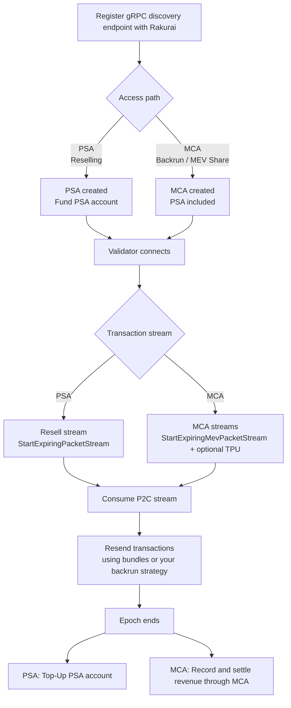

# Post-Pack Confirmations

Post-pack confirmations (P2C) — also called Rakurai pre-confirmation — give you a front-run-proof early view of what is about to execute. It is the third [TIN building block](../README.md#13-post-pack-confirmations-p2c): the Rakurai scheduler streams each transaction to you at the **point of no return** — committed to the block being built, but not yet public.

Paying for post-pack is one of two paths (not both):

- **[PSA](./psa.md)** — prepaid access for **pre-conf / reselling**.
- **[MCA](./mca.md)** — share backrun / MevShare profit with the validator. **PSA is included** on this path; you also get the TPU stream.

Tips are separate and still apply to reply bundles.

This page covers what the stream is, the wire protocol it uses, the end-to-end sequence from onboarding to settlement, and how the three money paths differ.

**Audience:** Searchers, TIN partners, traders consuming post-pack confirmations, and validator operators configuring endpoints.

**Related:** [Using P2C](./using_p2c.md) · [PSA](./psa.md) · [MCA](./mca.md) · [Setup guide](../setup_guide.md) · [Tips](../tips.md)

---

## 1. What are post-pack confirmations?

As soon as a transaction has been scheduled for execution, the Rakurai scheduler forwards it over gRPC to every configured **post-pack confirmation endpoint** — one packet per transaction, per endpoint.

> [!NOTE]
> **Updates start at the point of no return**
>
> Updates are generated from the **point of no return** — the moment the transaction is committed to the block being built. Consumers therefore see a transaction only when it is too late for anyone to front-run it. A post-pack signal is an *early scheduled* update, not a confirmation: confirm landing through standard commitment checks before treating it as final.

### 1.1. Protocol

Post-pack uses the TIN / P2C gRPC packet protocol ([`packet.proto`](../../../p2c-protos/protos/packet.proto), [`block_engine.proto`](../../../p2c-protos/protos/block_engine.proto)) — wire-compatible with the Jito `Packet` / `PacketBatch` shapes. If you already consume a Jito relayer stream, the layout is familiar.

- **Scheduler stream (ReSell, optional):** `StartExpiringPacketStream` — when `resell` (no-boost hash; **no TPU**).
- **Scheduler stream (Mev, optional):** `StartExpiringMevPacketStream` — when `mev` (boost-eligible hash).
- **TPU stream (optional):** `StartExpiringTpuPacketStream` — when `mev` + `enable_tpu_p2c_update`. Same `PacketBatchUpdate` wire type; tell streams apart by **which gRPC method** delivered the message. Return `UNIMPLEMENTED` if you do not use this path.
- **Count stream (optional):** `StartP2cUpdateCountStream` — once per slot, how many transactions the validator successfully sent on the leader-time and TPU P2C streams (plus totals).
- **Discovery:** `GetBlockEngineEndpoints` on the P2C host so validators can pick the lowest-latency region (same discovery RPC as bundles).
- **`expiry_ms` field:** despite the name, on the P2C path this is the validator’s **working-bank slot** (`u32`), not a millisecond timeout.
- **What you send back:** a **bundle** with the original post-pack packet(s) unchanged, plus your own txs. Backrun bundles that use **leader-time Mev source transactions** get an additional **20% virtual priority**.

Full mechanics, packet layout, and Admin RPC: [Using P2C](./using_p2c.md). Onboarding / Relayer setup: [Setup guide — BlockEngineRelayer](../setup_guide.md#8-set-up-blockenginerelayer-p2c).

### 1.2. End-to-end sequence

| Step | Action | Guide |
|------|--------|-------|
| 1 | Register a gRPC endpoint with Rakurai | [Setup guide](../setup_guide.md) |
| 2 | Pick a path: **PSA** (reselling) **or** **MCA** (backrun) — not both for access | [PSA](./psa.md) · [MCA](./mca.md) |
| 3 | Fund the PSA **or** hold MCA `record_authority` (**PSA included** in MCA — no separate PSA) | [`rakurai-p2c`](../../rakurai_programs/cli/p2c_subscription.md) · [`rakurai-revshare`](../../rakurai_programs/cli/partner_reward_settlement.md) |
| 4 | Validator connects out to your Relayer server | [Using P2C](./using_p2c.md) |
| 5 | Consume stream; reply with bundles (original packets + your txs + a tip) | [Tips](../tips.md) |
| 6 | Epoch ends → PSA fee deducted **or** MCA record + transfer | CLI docs above |

> [!TIP]
> **Still tip on reply bundles**
>
> Paying a tip to land a transaction is a **different path** from the PSA and MCA. A post-pack reply bundle still needs a tip to a [Rakurai tip account](../tips.md#appendix-program-and-tip-account-addresses) so it gets prioritized — **recommended: 1,000,000 lamports (0.001 SOL)**. See [Tips](../tips.md).

---

## 2. The two payments, side by side

Pick **one** access path for post-pack. Tips are independent of both.

| | **PSA** | **MCA** | **Tips (TCA)** |
|--|---------|---------|----------------|
| Full name | P2C Subscription Account | MevShare Collection Account | Tips Collection Account |
| Use when | **Pre-conf / reselling** | **Backrun / MevShare** | Landing priority on a tx or bundle |
| What you pay | Prepaid fee (**$50 / 1M Updates/txn**) | Agreed **% of backrun profit** | Whatever you tip |
| PSA required? | Yes — this *is* the PSA | **Included in MCA** — do not fund a separate PSA | No |
| Streams | Leader-time only | Leader-time **+ TPU** | — |
| Tool | [`rakurai-p2c`](../../rakurai_programs/cli/p2c_subscription.md) | [`rakurai-revshare`](../../rakurai_programs/cli/partner_reward_settlement.md) | `SystemProgram.transfer` |
| Guide | [PSA](./psa.md) | [MCA](./mca.md) | [Tips](../tips.md) |

> [!NOTE]
> **PSA or MCA — not both for access**
>
> Resellers prepay the PSA. Backrun partners settle through the MCA, which **includes PSA** (stream access) — do **not** also fund a separate PSA for the same service/validator. You still tip reply bundles separately.

Endpoints — where the scheduler **sends** you transactions — are stored separately in [Client Config](../../rakurai_programs/programs/rakurai_client_config/README.md). The PSA holds prepaid SOL; the MCA holds settled backrun SOL. Neither holds endpoint configuration.

> [!WARNING]
> **Do not count the same SOL twice**
>
> If `block_reward_conversion_enabled` is on (the default), PSA, MCA, and TCA claims are later re-emitted as a high-priority block reward. An indexer watching both will count the same lamports twice. See [TIN — indexing note](../README.md#6-do-not-double-count-tips-and-converted-block-rewards).

---

## 3. Next steps

| Guide | Description |
|-------|-------------|
| [Using P2C](./using_p2c.md) | Relayer gRPC setup, packet structure, reply bundles, validator Admin RPC |
| [PSA](./psa.md) | Prepaid stream access: pricing, status, grace window, funding |
| [MCA](./mca.md) | Reporting and settling your backrun share |
| [Tips](../tips.md) | Tip accounts and virtual priority for landing |
| [Setup guide](../setup_guide.md) | Discovery endpoint and Validator vs Relayer gRPC roles |
| [Reward Distribution](../../rakurai_programs/programs/reward_distribution/README.md) | The on-chain model behind PSA, MCA, and TCA |
