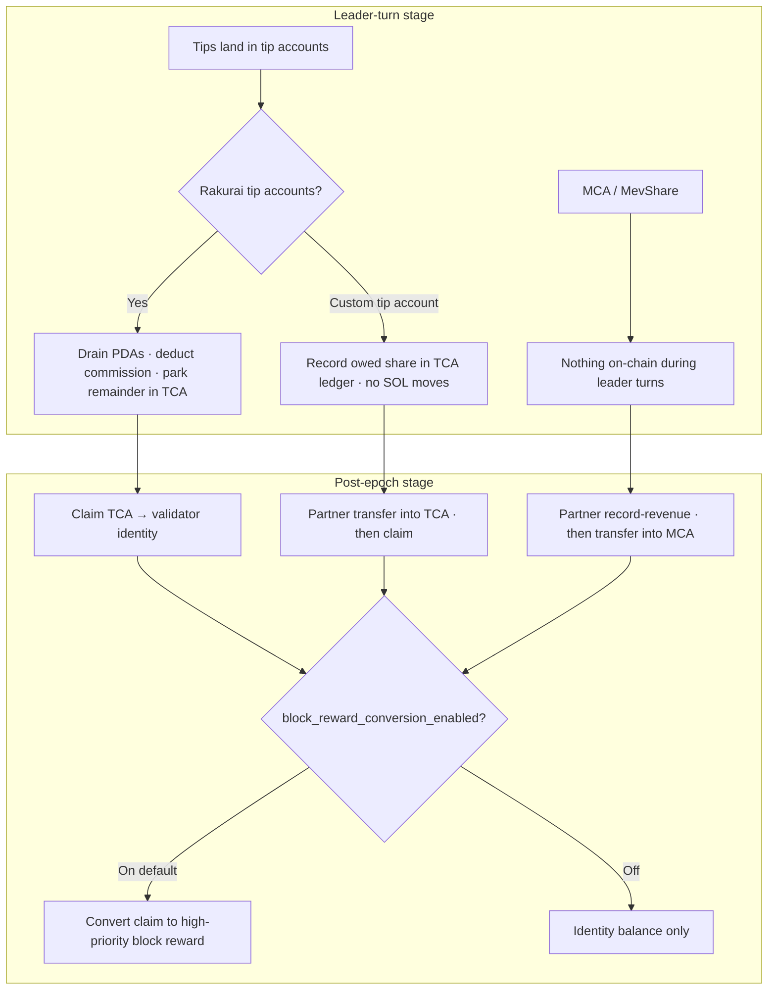

# Tips

A tip buys **scheduling priority** on a Rakurai validator. It is the [virtual priority boost](./README.md#12-virtual-priority-boost) building block of TIN: a plain SOL transfer to one of the [eight Rakurai tip accounts](#appendix-program-and-tip-account-addresses). The Rakurai scheduler counts that transfer as value when it decides what enters the block first.

The boost is **additive, not a substitute**. Rakurai bounds how far a tip can carry a transaction that pays almost no priority fee, so tips cannot cannibalize priority fees. The validator's share is collected separately from block rewards in a **Tips Collection Account (TCA)**.

This page covers how to send a tip, why there are eight tip accounts, how the scheduler turns a tip into priority, how to register a custom tip account, and how tips are drained and distributed each leader turn and each epoch.

**Audience:** Searchers, transaction inclusion services, and traders sending tips to Rakurai validators.

**Related:** [TIN overview](./README.md) · [Revenue settlement](./revenue_settlement.md) · [Post-pack confirmations](./post_pack/README.md) · [TCA program docs](../rakurai_programs/programs/reward_distribution/README.md#4-tca--tips-for-landing-transactions)

> [!TIP]
> **Recommended tip for high-priority transactions (backrun / MevShare)**
>
> **0.001 SOL** in your transaction or bundle, **in addition to** normal priority fees. Tip accounts: [appendix](#appendix-program-and-tip-account-addresses).


---

## 1. What are tips?

Tips help traders and searchers land bundles (or transactions) on Rakurai nodes. Higher tips generally receive higher scheduling priority than lower tips.

> [!NOTE]
> **Tips do not replace priority fees**
>
> A tip is paid **on top of** the normal priority fee, not instead of it. A transaction with a very high tip but very low priority fees gets little benefit from tip-based prioritization.

---

## 2. How are tips transferred?

### 2.1. Sending a tip

Tips are plain **SOL transfers** to one of the eight [Rakurai tip accounts](#appendix-program-and-tip-account-addresses). No special program instruction is required to *send* a tip — include a `SystemProgram.transfer` in your transaction (or bundle) that moves lamports from your wallet to any of those tip PDAs.

**Why eight accounts?** Write-lock contention. If every tipper hit a single account, transactions would serialize on that account lock. Eight parallel tip accounts let many tippers land simultaneously.

---

## 3. How do tips prioritize my transaction?

When your transaction includes a SOL transfer to a Rakurai tip account, that transfer amount is the **tip signal** the scheduler uses to prioritize your transaction (or bundle).

### 3.1. Virtual priority boost

Add a transfer instruction to one of Rakurai's tip accounts in your transaction or bundle (the same pattern as Jito tips). Virtual priority can boost both TPU transactions and bundles.

### 3.2. What you should do

1. **Include the tip inside your transaction** (or bundle) as a `SystemProgram.transfer` to one of the eight Rakurai tip accounts.
2. **Higher tip → higher scheduling priority** when the current slot leader runs the Rakurai scheduler. The scheduler weighs reward (tip + fees) relative to estimated compute cost, similar to Solana's standard priority formula.

### 3.3. What tips do *not* do

1. A tip is not a replacement for regular **priority fees**. Very low priority fees plus a very high tip still yield little tip-based prioritization.
2. Tips are independent of Solana's base fee and prioritization fee — they are an additional incentive for validators.

---

## 4. Can I use my own tip account instead of Rakurai's eight accounts?

Prefer Rakurai's tip accounts. For interim custom tip accounts, contact the Rakurai team — see [Setup guide](./setup_guide.md#4-contact-rakurai-and-share-your-wallet-pubkey) — to register your accounts and agree a commission share.

### 4.1. How it works

1. **Register your account** — provide tip account addresses and agree on a commission percentage you will share with Rakurai (e.g. 30%). A sample JSON list:

```json
{
  "tip_account_1": 0.20,
  "tip_account_2": 0.25,
  "tip_account_3": 0.30
}
```

2. **Rakurai adds your account to the validator flow** — tips sent to your custom account are recognized by the Rakurai scheduler. Validators control which tip accounts are effective through Admin RPC.
3. **Prioritization** — when someone tips your custom account, the agreed Rakurai share (e.g. 30%) is used by the scheduler to prioritize the transaction, the same way standard Rakurai tip accounts work.
4. **Settlement** — after the epoch ends, settle the agreed Rakurai share into the validator's **[TCA](../rakurai_programs/programs/reward_distribution/README.md#4-tca--tips-for-landing-transactions)** using the [Partner Tip and MevShare Revenue Settlement CLI](../rakurai_programs/cli/partner_reward_settlement.md) (`transfer --revenue-kind Tip`), following the [tip distribution flow](#6-how-are-tips-distributed).

---

## 5. How are tips accumulated?

On **every Rakurai leader turn**, the validator client automatically submits a tip-receiver claim transaction (`change_tip_receiver_v2`) that:

1. Drains all eight tip accounts (lamports above rent exemption from the **previous leader period**).
2. Transfers Rakurai's commission percentage to the Rakurai commission account.
3. Transfers the remaining share to the validator's **[TCA](../rakurai_programs/programs/reward_distribution/README.md#4-tca--tips-for-landing-transactions)**.

---

## 6. How are tips distributed?

Tip distribution has two stages. The mechanism differs for **Rakurai's tip accounts** vs an **external custom tip account**.

See [how tips vs backrun vs subscription are split](../rakurai_programs/programs/reward_distribution/README.md). Partners inspect pending amounts and settle with the [Partner Tip and MevShare Revenue Settlement CLI](../rakurai_programs/cli/partner_reward_settlement.md).

P2C access: prepaid **[PSA](./post_pack/psa.md)** for reselling, **or** **[MCA](./post_pack/mca.md)** MevShare for backrun (no PSA). See [`rakurai-p2c`](../rakurai_programs/cli/p2c_subscription.md) / [`rakurai-revshare`](../rakurai_programs/cli/partner_reward_settlement.md).



### 6.1. Leader-turn stage (every leader turn)

On every Rakurai leader turn, the claim transaction processes tips from the previous leader period:

- **Rakurai's eight tip accounts** — drained directly. Rakurai's share goes to the **Rakurai commission account** (commission percentage is set on-chain via the [Tip Manager config account](https://solscan.io/account/rKtiPTD7WuCdEEQ2JXWgAmZHHL9iZLc3niCXwtS7wSH?accountName=428560b549b70266#accountsData)); the remainder goes into the validator's **[TCA](../rakurai_programs/programs/reward_distribution/README.md#4-tca--tips-for-landing-transactions)**.
- **External custom tip accounts** — cannot be drained (Rakurai does not control them), so the attributed amount is only **recorded on-chain** in the relevant per-validator, per-service [TCA ledger](../rakurai_programs/programs/reward_distribution/README.md#4-tca--tips-for-landing-transactions) each leader turn. No lamports move at this stage.
- **MevShare (MCA)** — nothing happens on-chain during leader turns. Post-pack / MevShare revenue stays in the searcher or landing service's own accounts until the epoch ends.

### 6.2. Post-epoch stage (after epoch ends)

After the epoch ends, TCA and MCA revenue is distributed following the [claim and settle flow](../rakurai_programs/programs/reward_distribution/README.md#4-tca--tips-for-landing-transactions):

- **Rakurai's eight tip accounts** — the Rakurai tip balance in the relevant [TCA](../rakurai_programs/programs/reward_distribution/README.md#4-tca--tips-for-landing-transactions) is transferred to the validator identity account (optionally converted into block rewards). If conversion is on, do not count the tip **and** the converted block reward — see [double-counting note](./README.md#6-do-not-double-count-tips-and-converted-block-rewards).
- **External custom tip accounts** — the holder must first **settle** their agreed share into the relevant [TCA](../rakurai_programs/programs/reward_distribution/README.md#4-tca--tips-for-landing-transactions) (use [Partner CLI `transfer --revenue-kind Tip`](../rakurai_programs/cli/partner_reward_settlement.md#35-transfer--transfer-all)). Once settled, commission is deducted and the remaining share is transferred to the validator identity (optionally converted into block rewards).
- **PSA (P2C Subscription Account)** — top up the prepaid subscription or post-pack stops. See [PSA](./post_pack/psa.md).
- **MevShare (MCA)** — when you start using post-pack, Rakurai creates your MCA; you must hold its **`record_authority`**. After the epoch ends, **record** the owed revenue on the [MCA](../rakurai_programs/programs/reward_distribution/README.md#6-mca--sharing-post-pack-backrun-profit) **once** ([Partner CLI `record-revenue`](../rakurai_programs/cli/partner_reward_settlement.md#34-record-revenue-mca-only)), then **settle** it ([Partner CLI `transfer --revenue-kind Mev-share`](../rakurai_programs/cli/partner_reward_settlement.md#35-transfer--transfer-all)). Once settled, commission is deducted and the validator share is credited. Full flow: [MCA](./post_pack/mca.md).

If a holder does not settle within **2 epochs**, their account stops being used for prioritization starting from the next epoch (two-epoch grace period).

---

## 7. Common questions

**Q7.1: Do I need to interact with the Tip Manager program to send a tip?**  
A: No. A normal SOL transfer to any of the eight tip accounts is sufficient.

**Q7.2: Can I tip multiple accounts in one transaction?**  
A: Yes, but one transfer to one tip account is typical. Multiple transfers to the same account in one transaction still accumulate correctly.

**Q7.3: What happens if tips are never claimed?**  
A: They remain in the tip PDAs until the next Rakurai validator leader turn, when the validator runs `change_tip_receiver_v2`.

**Q7.4: Where does the validator's tip share go?**  
A: The validator's share is transferred to the **[TCA](../rakurai_programs/programs/reward_distribution/README.md#4-tca--tips-for-landing-transactions)** on every leader turn. After the epoch ends, it is transferred to the validator identity account.

**Q7.5: How is this different from a priority fee?**  
A: Priority fees use Solana's native fee mechanism. Rakurai tips are direct SOL transfers to tip PDAs that the Rakurai scheduler uses to prioritize bundles. Higher tips are generally scheduled before lower tips.

**Q7.6: Can I use a custom tip account instead of the eight Rakurai accounts?**  
A: For the time being, yes. Contact the Rakurai team via [Setup guide](./setup_guide.md#4-contact-rakurai-and-share-your-wallet-pubkey) to register your tip account and configure a commission share. See [custom tip accounts](#4-can-i-use-my-own-tip-account-instead-of-rakurais-eight-accounts).

**Q7.7: Where do I read about TCA, PSA, MCA, and post-pack?**  
A: [Reward Distribution](../rakurai_programs/programs/reward_distribution/README.md) and [Post-pack confirmations](./post_pack/README.md).

---

## Appendix: Program and tip account addresses

This is the canonical list. Tip any **one** of the eight accounts for your cluster with a `SystemProgram.transfer`; they are equivalent, and the eight exist only to spread write-lock contention.

> [!WARNING]
> **Mainnet and testnet accounts are not interchangeable**
>
> Each cluster has its own Tip Manager program and its own eight tip PDAs. A transfer to a mainnet tip account on testnet (or the reverse) is not recognized as a tip — the lamports simply move to an unrelated address and your transaction gets no prioritization.

### [Mainnet Tip Accounts](https://solscan.io/account/rKtiPTD7WuCdEEQ2JXWgAmZHHL9iZLc3niCXwtS7wSH)
    1. `BjqjPHFmwr19YFmkH8CMNJFbj1wzX9k9ngr4am2nQEdq`
    2. `9CNKnAqJgLA4pL6KByzhhdY4mKoQP5wcPdhJgnvvi5Ve`
    3. `5wy4C2VMFhHE4i8PWKNS1K4SV275zjNwhLwfKBwajrro`
    4. `AgMdA97pk2i2Ry4YQ4iVPNrRiFhcH3x3ARUCiQGt3vJG`
    5. `4Qf8JFV5vmpADXNouoJriQ9KiniT5DENrz9JM2mKGH9m`
    6. `AuFAFzbzE9dzMajy4RNdyJZBTskeiuJQqT2wd9xoGSRD`
    7. `8aLaHz8595MAvgxKoBJEyZmDfqQp8CorezFGYnC7CPjy`
    8. `H6hyJo6rpBmwHbvVuWCEHExJ2bE4rcn1hTPeiBtypus4`

### [Testnet Tip Accounts](https://solscan.io/account/4qRZaFzf7MvgfBTCP9grb69cCST8UmKHPtkpGAgkJosD?cluster=testnet)
    1. `3ahyXyni1jLj8kJ13VgGEFDJzB374dgQW273nJSg8cdm`
    2. `3aebD4TAn1somZfiaKRrMypUfmbDzT7XMVWRM5TFHuKW`
    3. `Hm4LFyTAbrgH4eejYmNXQJ9oejQyq8frD2qeJbmkCAWR`
    4. `AffPqNJ8jSrFGgfiouVfXcra1Vd6gHUjNhpoL8uW8dY5`
    5. `9Z4pSxRZzE1T2e6587yzMWtvo8RHKW3R5Rb2FcprUPz`
    6. `J2JdwcRrxWyCHKrgi2ipwCFXK2oRSgzPN4P7Q6Kz9XZ9`
    7. `DscP7KHpAvfnboSKEQ5KEcwuFuRWn6MTjKYYTftuqY6z`
    8. `Ur14r1oNyLvYeFLngGoEwYV4zwFVcui72vJqAavDXhZ`

Program mechanics for these accounts: [Rakurai Tip Manager](../rakurai_programs/programs/rakurai_tip_manager/README.md).
